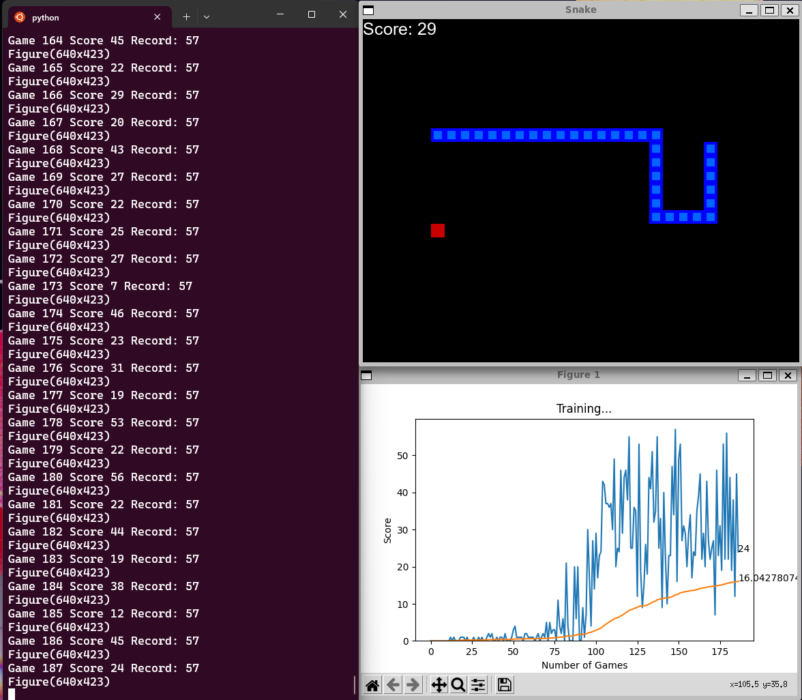
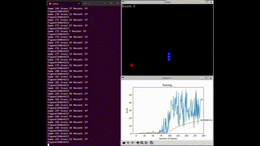

# AI SNAKE GAME






Activate conda.
```bash
conda init zsh # or `conda init bash`
conda create -n "pygame_env" python=3.7
conda activate pygame_env

conda deactivate # to deactivate
```

Install Pytorch from https://pytorch.org/

Download the python snake game from [here](https://github.com/patrickloeber/python-fun/tree/master/snake-pygame).

```bash
pip install -r requirements.txt
```